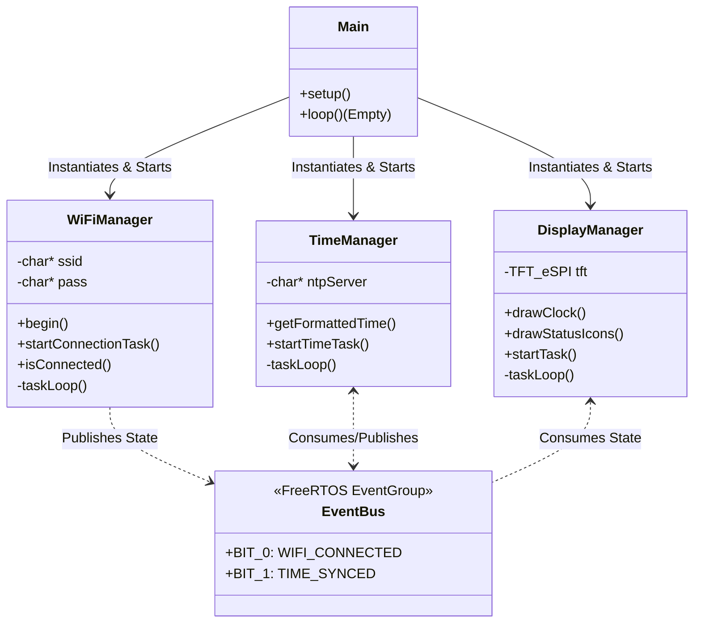
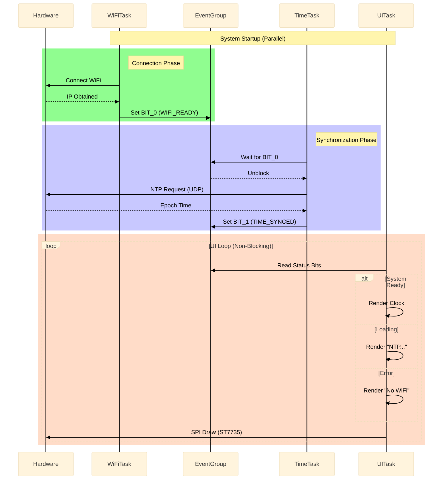
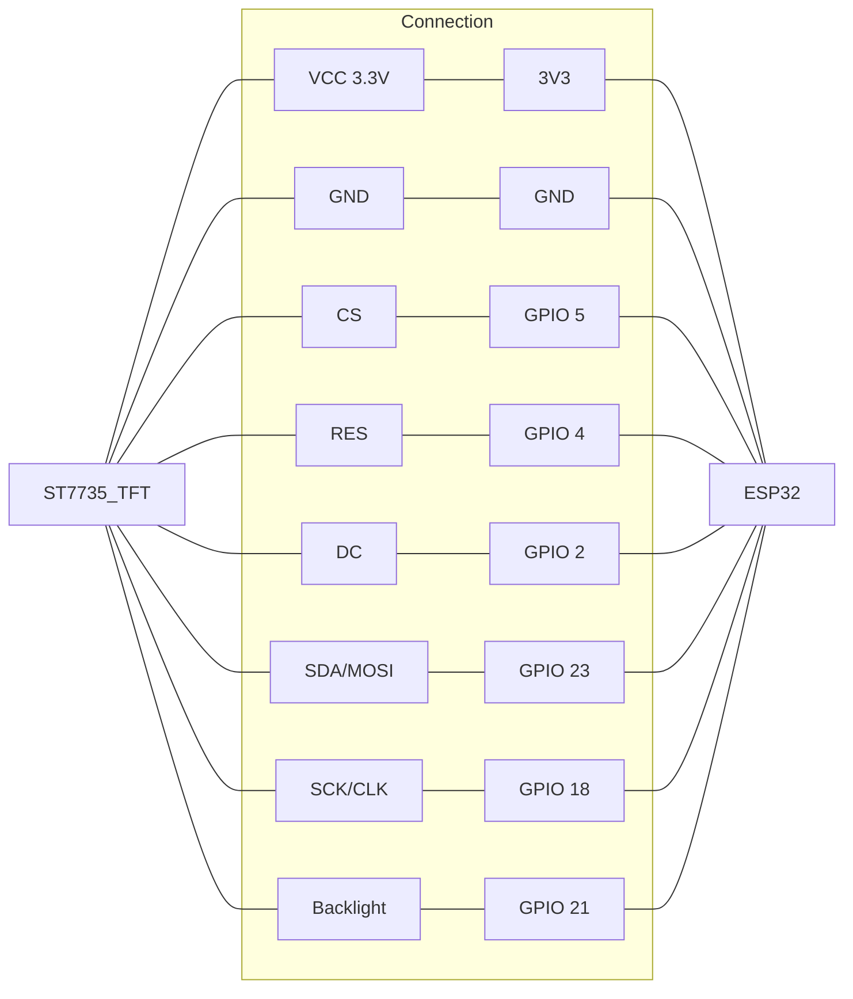
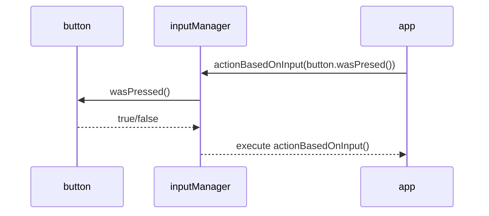
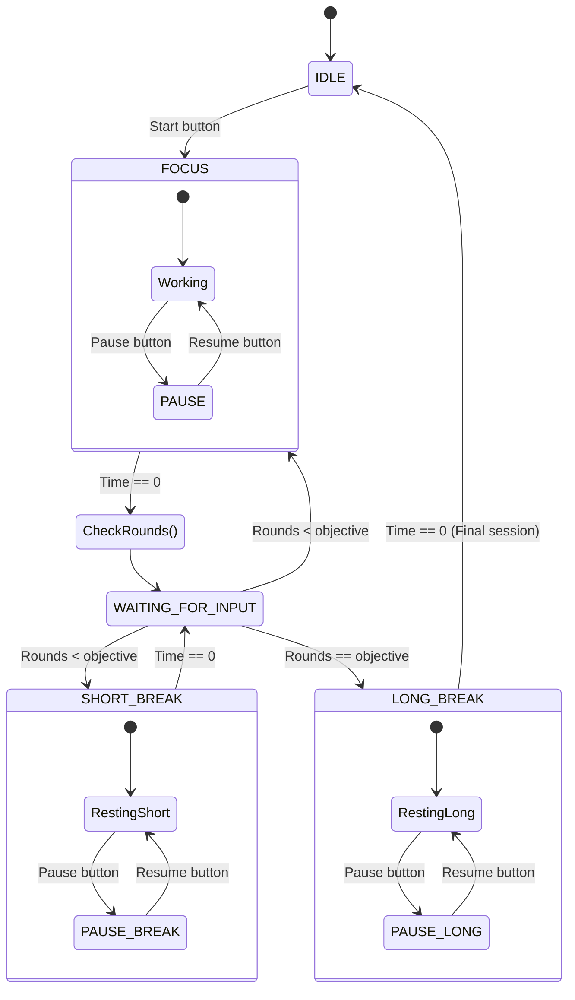

# Misk: Advanced Desktop Productivity OS

**Misk** is a real-time embedded operating system (RTOS) designed for desktop productivity devices. Built on **ESP32** and **FreeRTOS**, it uses an object-oriented architecture to manage multiple asynchronous tasks (UI, Networking, NTP Synchronization, apps such as Pomodoro timers, Clock,etc.) ensuring deterministic, robust, and scalable performance.

**NOTE THAT THIS IS AN EDUCATIONAL PROJECT MADE FOR PERSONAL USE AND ITS FINAL PURPOSE IS FOR LEARNING**

---

## System Architecture

The system tries to move away as much from the classic Arduino "Super Loop" to adopt a modular design based on **Managers**. Each critical subsystem (WiFi, Time, Display) runs in its own FreeRTOS Task, communicating exclusively through an **Event Bus (EventGroup)** to maintain decoupling.

### 1. Class Diagram (OO Design)
Business logic is encapsulated, separating hardware management (`Drivers`) from application logic (`Managers`).

### 2. Sequence Diagram
The system boots up and synchronizes without blocking the main CPU. The UI always remains responsive, even if the network goes down.

### Wiring diagram - ESP32 and ST7735 TFT 1,8"(160*128) 

## Input Manager
For the input we use a constant polling(20ms) due to the complications of using interruptions just for the buttons,

## Pomodoro Manager
The PomodoroManager has to synchronize depending on the state you are on and your configuration of rounds and time for each type of round. 
