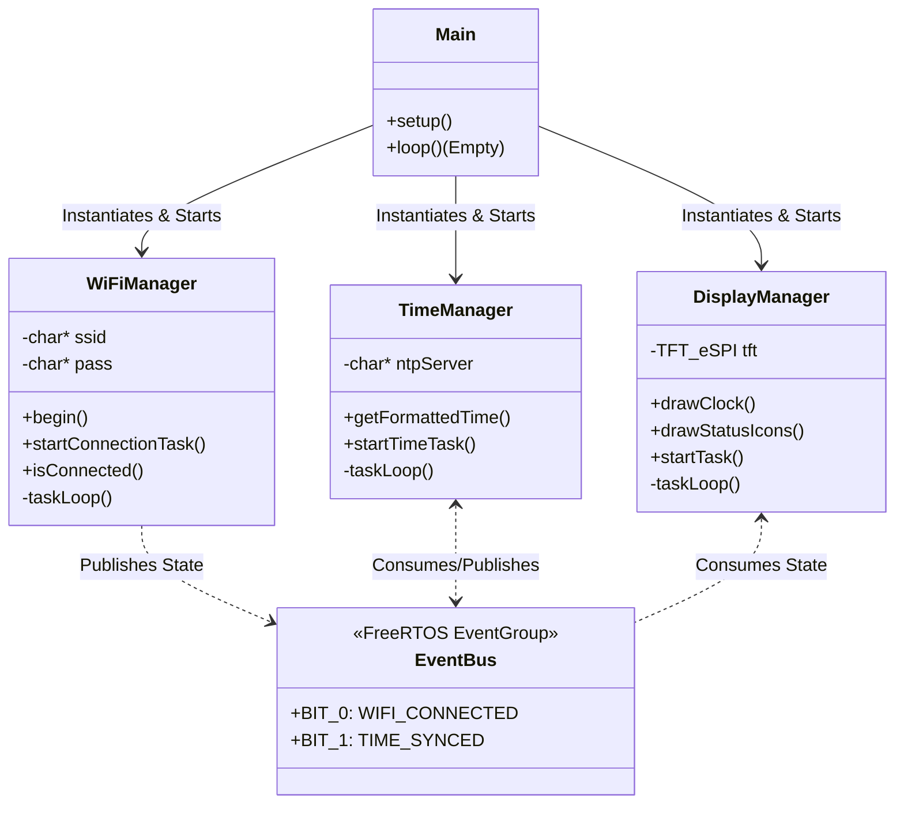
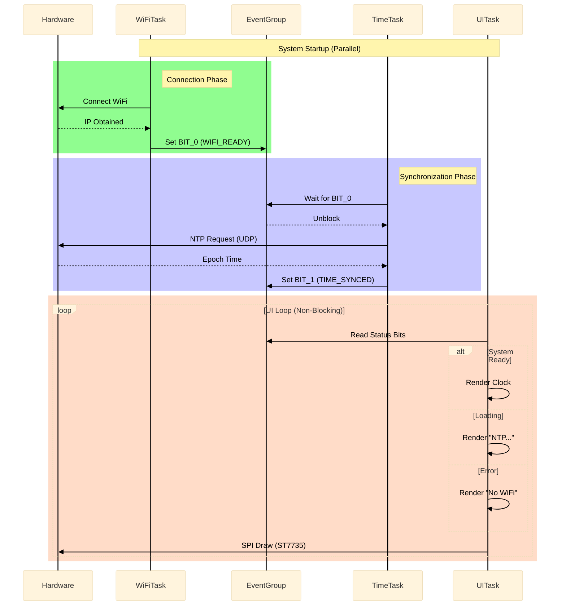
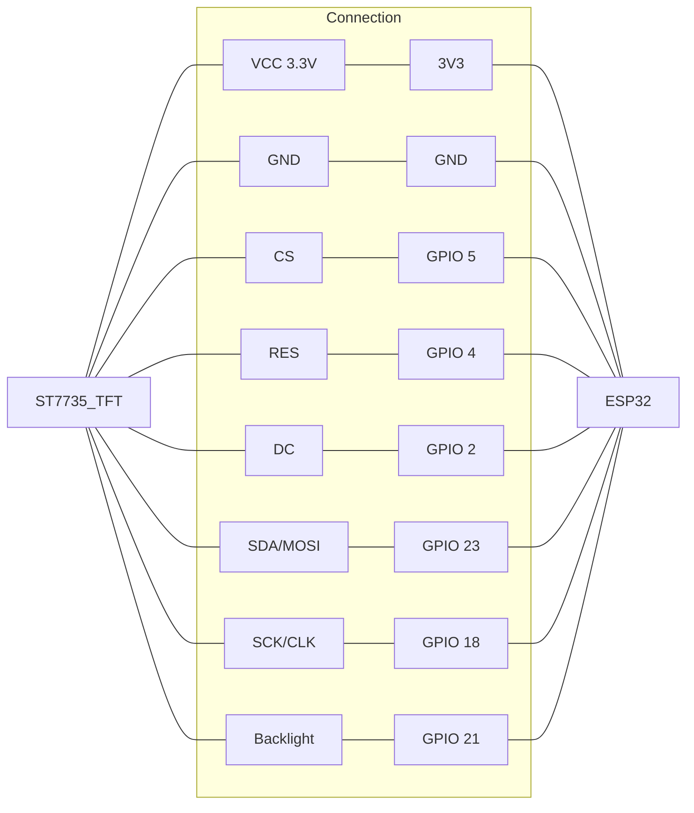

# Misk: Advanced Desktop Productivity OS

**Misk** is a real-time embedded operating system (RTOS) designed for desktop productivity devices. Built on **ESP32** and **FreeRTOS**, it uses an object-oriented architecture to manage multiple asynchronous tasks (UI, Networking, NTP Synchronization) ensuring deterministic, robust, and scalable performance.

---

## System Architecture

The system moves away from the classic Arduino "Super Loop" to adopt a modular design based on **Managers**. Each critical subsystem (WiFi, Time, Display) runs in its own FreeRTOS Task, communicating exclusively through an **Event Bus (EventGroup)** to maintain decoupling.

### 1. Class Diagram (OO Design)
Business logic is encapsulated, separating hardware management (`Drivers`) from application logic (`Managers`).

The sequence diagram shows how the system boots up and synchronizes without blocking the main CPU. The UI always remains responsive, even if the network goes down.

wiring diagram

